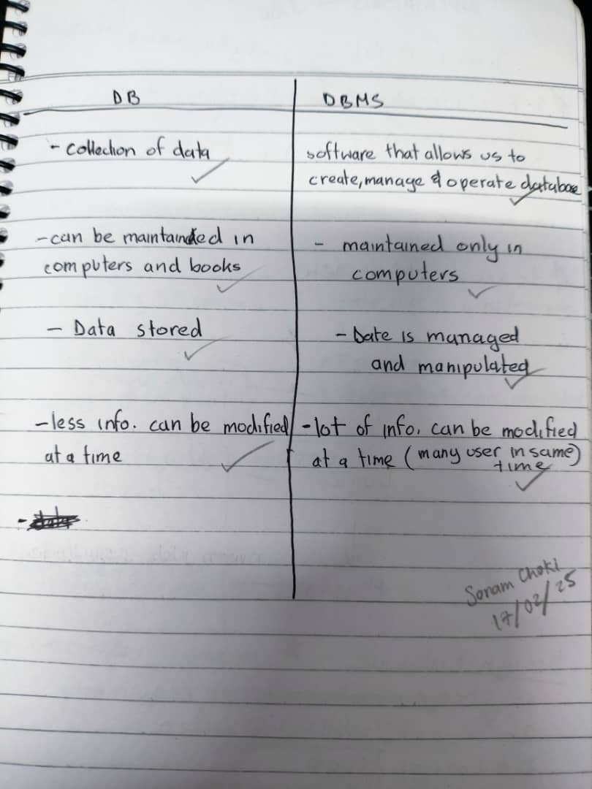

### Introduction
----
Database, any collection of data, or information, that is specially organized for rapid search and retrieval by a computer, or in simple way its a collection of data. In Unit 1 of the Database Systems class it introduces us to fundamental concepts such as database management systems (DBMS), data models, database architecture, and their real-world applications. These unit offers a strong foundation for understanding how data is structured and accessed in different industries.

#### Topic: Fundamentals of DataBase System
Lesson 1 of Unit 1 teached me about the importance of database systems and their advantages over traditional systems.
Some of the key points covered include:

Purpose of Database Systems: Databases stores large amounts of data efficiently, removing redundancy and improving security.

Disadvantages of File-Processing Systems: Traditional methods lead to data inconsistency, redundancy, and integrity issues.

Advantages of DBMS: Improved data security, consistency, flexibility, and better access control.

Applications of Databases: Industries like banking, social media, healthcare, and education rely on databases.

Evolution of Database Systems: From simple file-based storage to database management 
systems allows multiple users to access data while maintaining integrity.

##### HOMEWORK!
Question: Difference between database and database management system (Corrected by our peers)

#### Topic: Data Model and Data Architecture
As on in lesson 2, I learned to built upon these fundamentals by exploring database design and architecture. The key takeaways include:

Types of Data Models:

Entity-Relationship Model – Represents data entities and relationships.

Relational Model – Data stored in tables with relationships between them.

Object-Based Model – Stores data in objects, useful for complex applications.

Semi-Structured Model – Deals with irregular data, such as XML or JSON.

Database Design Process: Conceptual, logical, and physical database designs ensure efficient data structuring.

Database Languages:
Data Definition Language (DDL) – Defines database schemas.
Data Manipulation Language (DML) – Enables data retrieval and modification.

Database Engine: The core component that manages CRUD (Create, Read, Update, Delete) operations.

Database System Architecture: Explains how different applications interact with databases through APIs and query processors.

#### What I Learned
I learned that Understanding databases is important because data drives decision-making in nearly every industry. These unit highlighted:

-The significance of structured data management.
-The necessity of using DBMS to ensure efficiency and accuracy.
-The different database models and their suitability for specific use cases.
-How database architecture supports application development and real-world implementations.

This knowledge is not just theoretical; it has practical implications in industries such as healthcare, banking, social media, and logistics. Efficient database management ensures seamless operations and better decision-making.

----
The End 

----