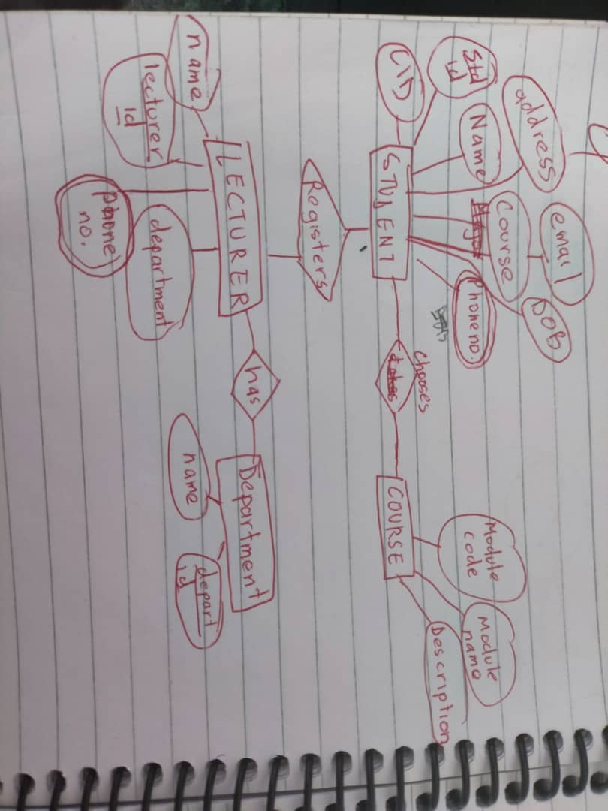

### Introduction
----
Databases play a critical role in modern data management, ensuring structured storage and efficient retrieval of information. In this unit I learned Entity-Relationship Diagrams (ERD), Relational Model and Schema Design, ERD to Relational Schema Translation, and Relational Algebra. These concepts form the foundation of database design and operation, enabling robust data structuring and efficient query execution.

#### Topic: Entity-Relationship Diagrams (ERD)

Entity-Relationship Diagram (ERD) is an essential tool in database design that visually represents the logical structure of a database.
ERD consist of three key components:

1.Entities – Objects that represent real-world things, such as students, customers, or products.

2.Attributes – Properties or characteristics of entities, such as a student’s name, CID and Student ID.

3.Relationships – Associations between entities, such as a student enrolling in a course.

##### ERD Notations

ERDs help designers conceptualize data before implementing a database, ensuring efficiency and reducing redundancy​

##### HOMEWORK!
Draw an entity relationship diagram for the student registration system at CST

#### Topic: Relational Model and Schema Design
The relational model organizes data into tables (relations), where each row (tuple) represents an entity, and each column (attribute) represents a property of that entity. 

Important components of the relational model includes:

Primary Key – Uniquely identify each record in a table.  
Foreign Key – Establish relationships between tables.  
Schema Design – Defines how data is structured and constraints are enforced to maintain integrity.

This lesson emphasizes the importance of designing schemas that minimize redundancy and ensure data consistency

#### Topic: ERD to Relational Schema Translation
Once an ERD is created, it needs to be converted into a relational schema that can be implemented in a database management system. The process includes:

Creating tables for each entity – Each entity in the ERD is translated into a table.

Handling multivalued attributes – Separate tables are created for attributes that can have multiple values.

Mapping relationships – Many-to-many relationships are represented by creating a new table containing foreign keys from the related tables.

Applying normalization – Ensuring efficient data organization by eliminating redundancy and dependencies

#### Topic: Relational Algebra
Relational Algebra is a theoretical framework that defines how data can be retrieved and manipulated in a relational database. It consists of a set of operations used to query the data:

UNARY OPERATIONALs: 
Selection (σ) – Filters rows based on conditions. 
Projection (π) – Selects specific columns. 

BINARY OPERATIONALs: 
Union (∪) – Get all tuples that appear in either  one or both table. 
Intersection (∩) - contains only the tuples that appear in both table.  
Difference (-) – Finds records in one table that do not exist in another.
Join (⋈) – Combines tables based on a common attribute. 
Product(x) - Contains all possible combinations of tuples from both table.  

OPERANDs: 
^ AND 
v OR 
¬ NOT 
.> GREATER THAN 
< LESS THAN 
= EQUAL TO 

These operations form the foundation of SQL queries, helping in efficient data retrieval and processing

#### What I Learned
Through these lessons, we gained valuable insights into database design and management:

-ERDs help visualize database structures before implementation, preventing design flaws. 
-The relational model ensures data integrity and consistency through well-structured tables and relationships. 
-Translating ERDs into schemas bridges the gap between design and implementation, making data storage more efficient. 
-Relational algebra provides the fundamental operations for querying and manipulating databases.

Mastering these concepts is essential for anyone interested in database management, as they lay the groundwork for advanced database design and optimization.

----
The End

----