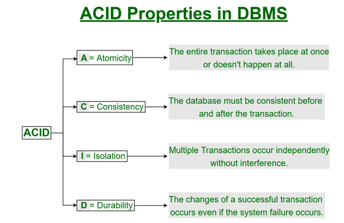

### Introduction
----
In this unit we learn about SQL, Structured Query Language which is the standard language for managing and manipulating relational databases. There are three lessons which covers the essential SQL concepts, from basic queries to advanced operations like subqueries, joins, and database modifications. These helped me in understanding the structure of SQL and its practical applications in handling data.

#### Topic: SQL Basics and ACID Properties
In first lesson it introduces the core components of SQL as the standard language for managing relational databases, including Data Definition Language (DDL) and Data Manipulation Language (DML). And some fundamental concepts such as:

ACID Properties: Atomicity, Consistency, Isolation, and Durability ensure reliable transactions.
 
SQL Constraints: Used to enforce rules on data, such as NOT NULL, UNIQUE, PRIMARY KEY, and FOREIGN KEY.  
Basic SQL Queries: Commands like CREATE TABLE, INSERT INTO, SELECT, and DELETE are crucial for database management. 
Basic Schema Definition: How to define a database schema using SQL syntax. 

#### Topic: SQL Queries and Set Operations
This lesson explains more on SQL queries, focusing on retrieving, modifying, and deleting data. It introduces the WHERE clause for filtering, ORDER BY for sorting, and set operations for querying multiple tables.

SELECT Statements: SELECT * FROM table_name; retrieves all entries. 
WHERE Clause: Filters records based on conditions (e.g., WHERE Gender = 'Male'). 
ORDER BY Clause: Sorts results (example. ORDER BY Last_Name DESC). 
Set Operations: Combining query results using UNION, INTERSECT, and EXCEPT. 
Table Modifications: ALTER TABLE for adding, modifying, or renaming columns. 

#### Topic: Advanced SQL Concepts
The last lesson covers the advanced SQL features like the nested subqueries, aggregation, and database modification techniques.

Nested Subqueries: Using queries within queries for complex filtering.
 
Aggregate Functions: Functions like COUNT(), AVG(), SUM(), MIN(), and MAX() process data efficiently. 
Group By & Having Clause: Used for summarizing data based on certain conditions. 
Modification of Database: UPDATE, DELETE, and INSERT operations to modify data.

#### What I Learned
- SQL ensures structured and efficient data management. 
- The ACID properties are essential for database integrity. 
- SQL queries allow for powerful data retrieval and modifications. 
- Advanced operations like nested queries and set operations enhance data analysis. 
I also learned that understanding SQL fundamentals is crucial as databases are at the core of nearly all applications today, from web services to financial transactions. These lessons have provided a strong foundation for managing relational databases effectively.

----
The End 

----